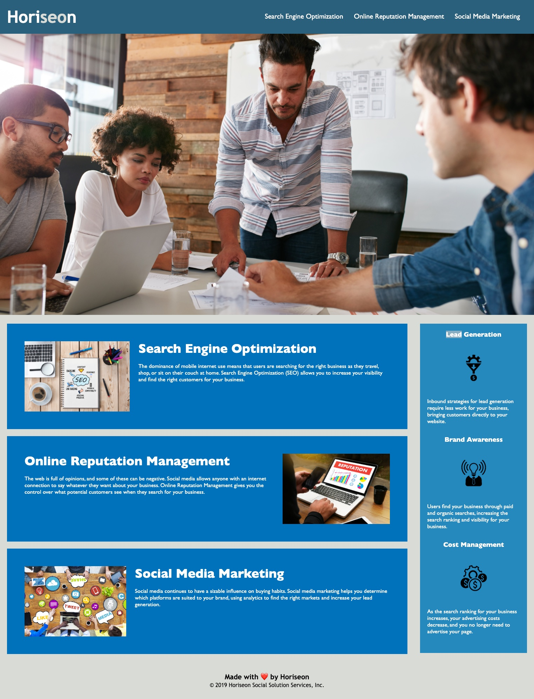
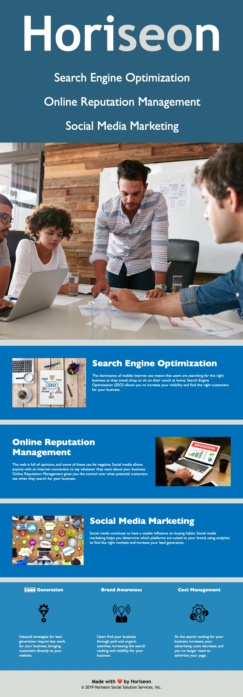
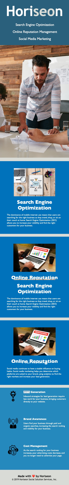

# horiseon
This site is for the marketing agency Horiseon. It is a static html site with responsive css.

## Updates

The site has now been refactored to make it more accessible for screen readers (adding img alt attributes and semantic HTML), as well as fix a bug with the first nav link. There were also opportunities to clean up the code to remove redundant selectors, improve structure, and add comments for developer clarity.

The site is also now responsive for mobile screens using media queries and flexbox.

### Desktop

 

### Tablet

 

### Mobile

